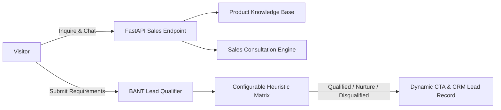

# AI Website Sales Chatbot

An autonomous website sales agent engineered to qualify inbound leads in real time, recommend appropriate solution tiers, handle objections, and maximize conversion through dynamic Call-to-Action (CTA) generation.

Part of the **50 AI Automation Projects Portfolio** by [ERHA TECHNOLOGIES](https://github.com/erhatechnologiesai).

---

## Architecture


## Features
- **Instant Product Knowledge**: Delivers precise pricing and feature comparison.
- **BANT Lead Qualification**: Scores prospects on Budget, Authority, Need, and Timeline.
- **Dynamic CTA Generation**: Routes qualified leads to VIP calls; directs lower scores to nurture sequences.

## Installation
```bash
pip install -r requirements.txt
python -m uvicorn app.api:app --reload
```

## Testing
```bash
python -m unittest tests/test_sales_bot.py
```
